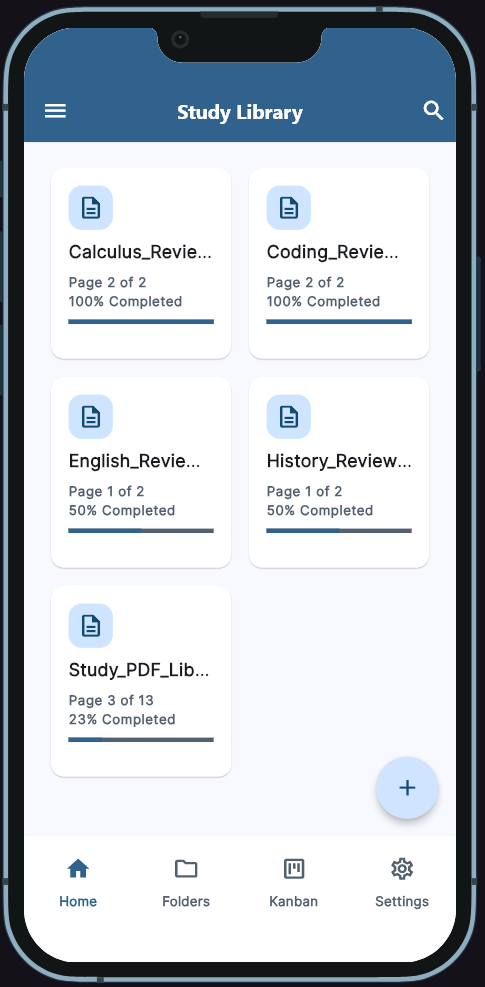
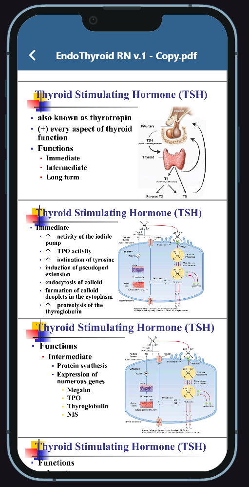
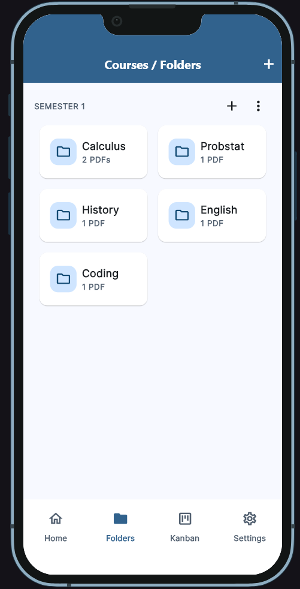
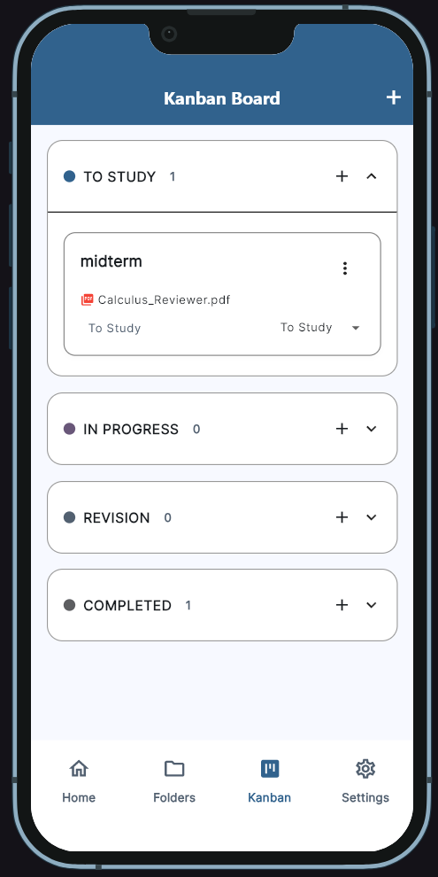
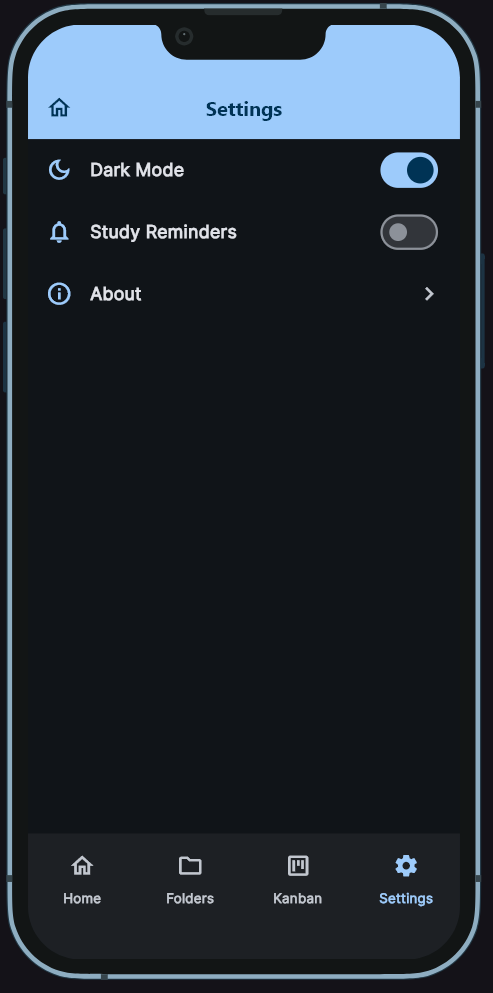

# Study PDF Library

- **Live demo:** [kleinz17.github.io/Study-PDF-Library/](https://kleinz17.github.io/Study-PDF-Library/)
- **Course:** Applications Development and Emerging Technologies (6ADET), Holy Angel University  
- **Author:** Kleinz17 

---

## 1. Overview

Study PDF Library is a mobile-responsive Flutter study pdf reader app designed for students and self-learners to organize course review materials, track reading progress, and read PDF review documents seamlessly. It provides a clean, minimalist interface and simplistic design principles with custom theme roles and progress indicators.

---

## 2. Setup and installation

Follow these steps to get the app running from scratch:

- **Flutter & Dart Versions:** Built with Flutter 3.44.8 (Dart 3.12.2).
- **Clone the repository:**
  ```bash
  git clone https://github.com/Kleinz17/Study-PDF-Library.git
  cd Study-PDF-Library
  ```
- **Install dependencies:**
  ```bash
  flutter pub get
  ```
- **Database Code Generation (Drift):**
  If modifying database schemas, run the Drift code generator:
  ```bash
  flutter pub run build_runner build --delete-conflicting-outputs
  ```
- **Configuration:**
  This project reads configuration from a `.env` file (if required for backend or API extensions). Copy `.env.example` to `.env` and fill in any placeholder values:
  ```bash
  cp .env.example .env
  ```
  *(Placeholder example: `EXAMPLE_API_KEY=your_api_key_here` — never commit real secrets).*

---

## 3. How to run it

Run the app on Windows desktop:

```bash
flutter run -d windows
```

or on Chrome / Web:

```bash
flutter run -d chrome
```

When running successfully, you will see the **Study Library Home Screen**, where you can import local PDF files using the floating action button (`+`), save them to the local Drift database, and view them natively in the PDF Viewer with automatic progress persistence.

---

## 4. Features and usage

Walk through the primary user flow, screen by screen:

1. **Home Screen (Library):**
   - Displays a grid of imported study PDF review cards from the local SQLite database.
   - Each card shows the file title, progress badge, and a `LinearProgressIndicator`.
   - Floating Action Button (`+`) opens the device file picker to import custom `.pdf` study materials.
   - Tapping any card navigates to the PDF Viewer.
2. **PDF Viewer Screen:**
   - Renders selected PDF documents utilizing the `pdfrx` package (`PdfViewer.file`).
   - Automatically tracks and updates current page reading progress in the database.
3. **Additional Screens & Components (App Shell & Navigation):**
   - **Folders Screen:** Organized study material categories.
   - **Kanban Study Task Board:** Task tracking and study planning board.
   - **Settings Screen:** App preferences and configuration.
   - Navigation managed via `AppShell` with Material 3 bottom navigation bar and custom components (`PrimaryAppBar`, `PrimaryFab`, etc.).

---

## 5. Project structure

A short map of the `lib/` directory and key files:

```text
lib/
├── main.dart                  # App entry point with DevicePreview configuration
├── theme.dart                 # Material 3 theme, AppSpacing, and StatusColors definitions
├── app_shell.dart             # Main bottom navigation shell managing tabs and database instance
├── database/
│   ├── app_database.dart      # Drift SQLite database definition (Documents table)
│   └── app_database.g.dart    # Generated Drift database code
├── screens/
│   ├── home_screen.dart       # Main library grid view with document cards and file picker
│   ├── pdf_viewer_screen.dart # PDF document reader screen using pdfrx with progress tracking
│   ├── folders_screen.dart    # Folders management screen stub
│   ├── kanban_screen.dart     # Study task kanban board screen stub
│   └── settings_screen.dart   # App settings screen stub
└── widgets/
    ├── pdf_card.dart          # Reusable card widget for study documents
    ├── folder_card.dart       # Folder item component stub
    ├── primary_app_bar.dart   # Standardized M3 app bar component stub
    ├── app_bottom_nav.dart    # Bottom navigation bar component stub
    ├── primary_fab.dart       # Floating action button component stub
    ├── kanban_status_section.dart # Kanban section column component stub
    ├── task_list_item.dart    # Kanban task list item component stub
    ├── settings_list_item.dart# Settings row component stub
    ├── primary_button.dart    # Standardized filled button stub
    └── empty_state.dart       # Empty state display component stub
```

---

## 6. Screenshots

| Home Screen (Library) | PDF Viewer Screen | Folder Screen | Kanban Screen | Settings Screen
| --- | --- |
|  |  |  |  | 

---

## 7. Known issues and next steps

- **Current Limitations:** 
  - Pdf can only view. No bookmarks and additional controls yet.
  - Web testing doesn't work (may not go forward due to local database behaviors)

- **Next Steps:**
  - Polish
  - Fix bugs


---

## AI Usage

- AI tools (Claude / ChatGPT / Agents) were used as coding assistants for structuring Material 3 themes, and drafting documentation. It is also used as a self study tool for app development. See `AI-USAGE.md` for full details.
