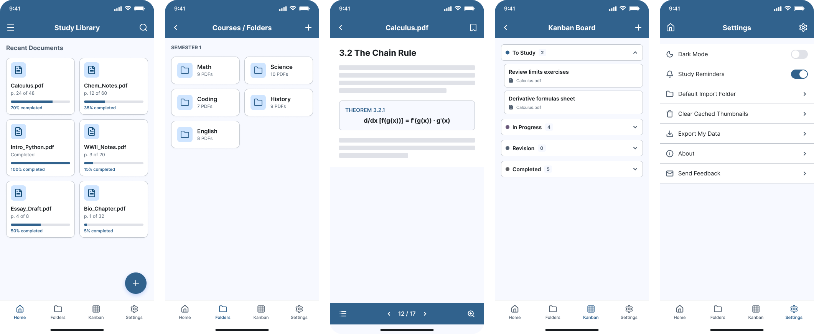
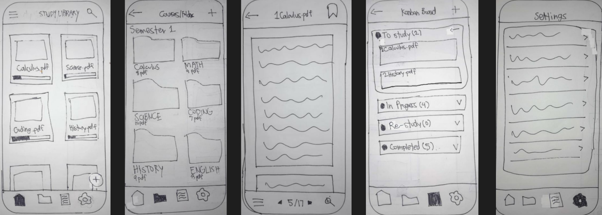
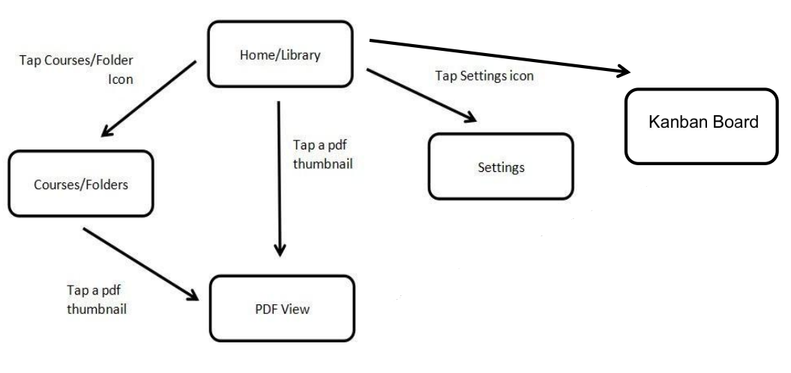

# Mockup and wireframes

## Mockup

## Wireframes

## Screens

- **Homescreen:** Sees all imported PDFs at a glance, with reading progress on each card. Tap card PDF View. Tap + file picker. Bottom nav → Folders /Kanban / Settings.

- **Courses/Folders:** Browses subjects, each showing how many PDFs it holds. Tap folder filtered PDF list Tap+new folder dialog. Tap PDF within → PDF View.

- **View PDF:** Reads the document with page navigation, zoom, and one-tap bookmarking.
Tap back previous screen Tap bookmark → saves current page › or (scroll) → change page.

- **Kanban Board:** Tracks study tasks across four stages of progress. Tap + create task. Tap task view/edit. Tap header → expand/collapse column.

- **Settings:** Adjusts app-level settings and preferences Tap row sub-screen or toggle. Tap home icon → back to Home
